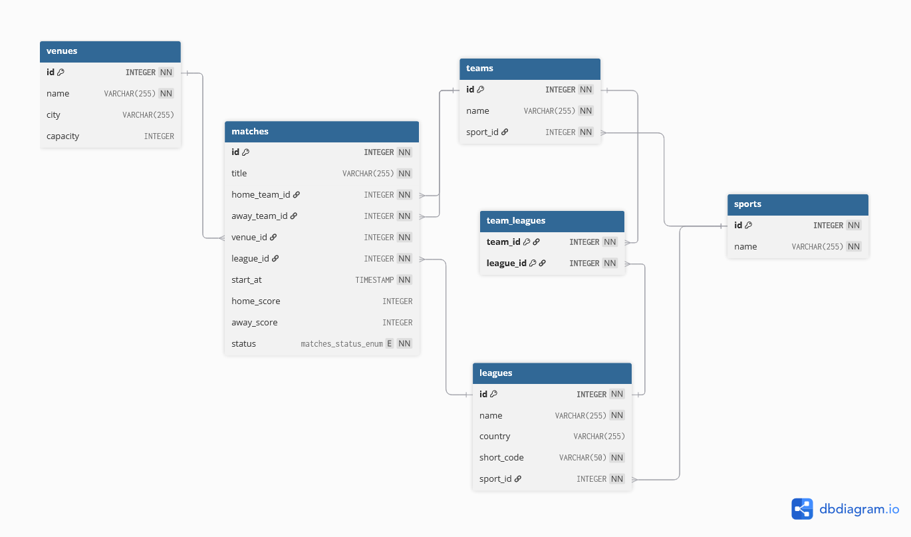

# Sportradar Coding Academy 2026 – Backend

This repository contains my solution for the Sportradar Coding Academy Backend take-home assignment.

The application exposes a REST API to browse matches, sports, leagues and teams and to create and manage matches over them.
Domain rules (team belongs to sport, valid time, teams must differ, etc.) are validated inside the Match aggregate rather than in controllers or services.

## Tech Stack

- Java 21
- Spring Boot 3
- MariaDB
- JPA / Hibernate
- JUnit 5 / Mockito

## Getting started

### 1) Database

You need a running MariaDB server on your machine.  
The application expects it on `localhost:3306` with:

- username: `root`
- password: `1234`

Create the database once:

```sql
CREATE DATABASE sports_calendar;
```
### 2) Configuration

`src/main/resources/application.properties` (already provided):

```
spring.application.name=sports_calendar

spring.datasource.url=jdbc:mariadb://localhost:3306/sports_calendar
spring.datasource.username=root
spring.datasource.password=1234

spring.sql.init.mode=always
spring.sql.init.schema-locations=classpath:schema.sql
spring.sql.init.data-locations=classpath:data.sql

spring.jpa.hibernate.ddl-auto=none
spring.jpa.show-sql=true
```

> `schema.sql` and `data.sql` will be applied automatically on startup.

### 3) Run

With Maven Wrapper:

```bash
./mvnw spring-boot:run
```

Or build + run:

```bash
./mvnw clean package
java -jar target/*.jar
```
→ The application runs on http://localhost:8080

### 4) Tests

```bash
./mvnw test
```

## API overview

Public endpoints (selection):

- `GET /sports`
- `GET /sports/{id}`
- `GET /sports/{id}/leagues`
- `GET /sports/{id}/teams`

- `GET /leagues`
- `GET /leagues/{id}`
- `GET /leagues/{id}/teams`

- `GET /teams`
- `GET /teams/{id}`
- `GET /teams/{id}/leagues`

- `GET /matches` (supports filters via `MatchSearchDto`, `q` triggers full-text search)
- `GET /matches/{id}`
- `POST /matches`

Controllers and DTOs are documented with Javadoc (public API boundary).

## Domain model

Entities:

- Sport
- League
- Team
- Venue
- Match (aggregate root)

Match invariants:

- Home team and away team must be different.
- Both teams must belong to the same sport as the league.
- `startAt` must be in the future.

An approximate `homeWinProbability` is exposed for scheduled matches (derived in `WinProbabilityService`).

## Database design (ERD)

Normalized to third normal form.  
Tables include `sports`, `leagues`, `teams`, `venues`, and `matches` (FKs to teams, venues, leagues).



## Code quality & testing

- **Controllers**: thin, map domain → DTO, no business logic.
- **Services**: orchestration only; domain rules live in aggregates.
- **DTOs**: separate request/response models (`CreateMatchRequestDto`, `MatchSearchDto`, `MatchDto`, etc.).
- **GlobalExceptionHandler**: consistent JSON error responses for validation and domain violations.
- **Tests**:
  - Controller tests (MockMvc) for all endpoints
  - Service unit tests (Mockito) for orchestration
  - Domain-derived value test (`WinProbabilityService`)
  - Domain invariants tested in `Match.schedule(...)`

## Notes & assumptions

- Uses MariaDB (no in-memory DB for runtime).  
- Credentials are configured via `application.properties`; adapt as needed.
- Seed data provided via `data.sql` for quick start.
- The app runs on http://localhost:8080
- Live sample events in `data.sql` are dated on **07 November**  
  These live examples assume “today” is 07 November, so that the live state makes sense against the static seed data.


## AI Reflection

See [AI_Reflection](./AI_Reflection.txt) for details on AI usage.
